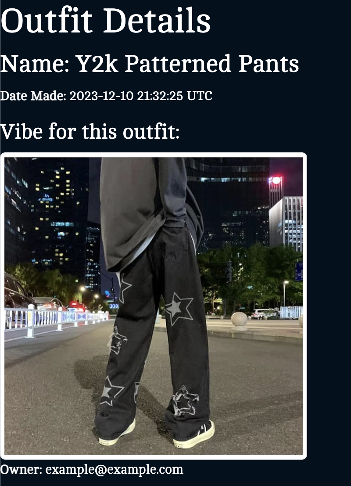

This is my code for my final project. UPick
This is going to be your personal online closet. When you're getting up in the morning whether it's getting ready for work or a special event, you will no longer have to go through every single outfit option. Log your outfits, your options and pick and choose while taking the train, walking home, even at the gym. 
How to get started?
Make your own account and start logging.

First, create your items. This will require a photo url, a description of the item or name, and what color the item is.

Once you create a couple items you can head over to the outfits page. You will start by clicking create outfit.

 Here you will select the items that belong to the outfit, you will provide a photo url of the vibe or inspiration you have for the outfit and of course a name for the outfit which could be an event or again the vibe you are going for. 
 
 
 Mix and match and create your outfits
 
